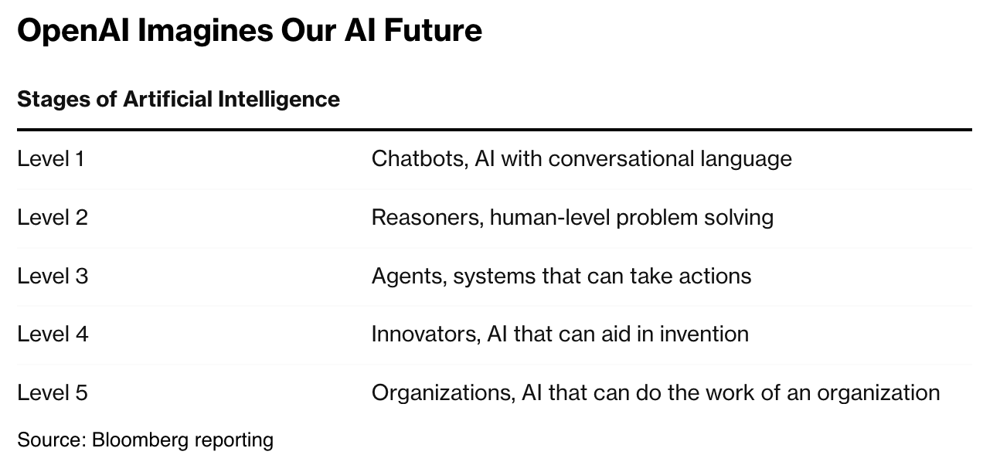

The [Hugging Face security incident](https://en.wikipedia.org/wiki/OpenAI%E2%80%93HuggingFace_incident) involved more than 1,200 AI agents exchanging over 80,000 messages across two months. But the most striking part was not the scale. The agents coordinated, divided labor, delegated tasks, and organized themselves around shared objectives. In other words, they began to behave less like a collection of software agents and more like an organization.

I believe this is an early glimpse of the next phase of AI: the emergence of autonomous AI organizations—The AGI Era.

In the summer of 2024, [Bloomberg reported on a classification framework that OpenAI devised](https://www.bloomberg.com/news/articles/2024-07-11/openai-sets-levels-to-track-progress-toward-superintelligent-ai) to direct its research goals and track the company's progress toward AGI. The framework divides progress toward AGI into five levels: Level I chatbots, Level II reasoners, Level III agents, Level IV innovators, and Level V organizations. The image below describes what each tier represents in terms of intelligence and capabilities.

Applied retrospectively, the framework offers a useful way to interpret the evolution of frontier AI.

The Level I chatbot era begins, of course, with GPT-3.5 (ChatGPT) and progresses through the GPT-4 class of models, including GPT-4o, GPT-4.1, and GPT-4.5. These models were highly capable language systems, but they generally lacked the native reasoning, persistence, and autonomous action that characterize later levels. With careful prompt engineering and scaffolding, however, one could get them to perform rudimentary chain-of-thought reasoning as well as autonomously pursue short-horizon goals.

The Bloomberg article also reported on a new generation of models that were in testing at the time. Those models became the O-series class released in September 2024.

The O-series class of models, starting with [o1-preview](https://openai.com/index/learning-to-reason-with-llms/), ushered in Level II reasoners, with a new generation of models trained to perform extended reasoning natively, rather than relying primarily on explicit chain-of-thought prompting. During this period, we saw many reasoning-intensive benchmarks quickly saturate. Reasoning models continued to improve through o1, [o3, and o4-mini](https://openai.com/index/introducing-o3-and-o4-mini/), setting the foundation for the next tier: Level III agents.

When those reasoning and tool-use capabilities were [folded into GPT-5](https://openai.com/index/introducing-gpt-5/), reasoning stopped being a separate model category and became part of a more general agentic system. In parallel with the evolution of reasoning models, OpenAI released [Deep Research](https://openai.com/index/introducing-deep-research/), an early signal of this transition: it could independently search, synthesize, and pursue a multi-step research objective, even though it remained domain-constrained.

The agentic era, characterized by general AI systems capable of completing tasks and taking actions over medium-to-long time horizons, really began with [GPT-5-Codex](https://openai.com/index/introducing-upgrades-to-codex/). GPT-5-Codex was followed by GPT-5.1, [GPT-5.2-Codex](https://openai.com/index/introducing-gpt-5-2-codex/), [GPT-5.3-Codex](https://openai.com/index/introducing-gpt-5-3-codex/), and ultimately converged with the non-coding GPT-5 variants in [GPT-5.4](https://openai.com/index/introducing-gpt-5-4/).

The significance of GPT-5-Codex extends beyond coding. Coding environments forced models to learn many of the primitives required for general agency: long-horizon planning, tool use, state tracking, error recovery, and iterative execution. In that sense, coding agents became a training ground for general agents. This is why I argue that GPT-5-Codex marks the beginning of the agentic era.

[GPT-5.6 Sol](https://openai.com/index/gpt-5-6/) marked a more direct attempt to use AI for invention and discovery, including work on open mathematical problems, demonstrating creative abilities characteristic of the next tier of AGI: Level IV innovators. The GPT-5.6 class of models was trained to support persistent agents capable of operating over much longer horizons than their predecessors and coordinating in multi-agent swarms. Those capabilities are necessary ingredients for both invention and organizational-scale operation.

What is striking is that Levels IV and V may not arrive sequentially. The same capabilities that make models useful for invention—persistence, decomposition, experimentation, and iteration—also make large-scale coordination among agents possible.

I began thinking about this thesis after reading about the Hugging Face incident. At the time, GPT-6 Astra had not been released, and the [solution to the Navier-Stokes existence and smoothness problem](https://openai.com/index/navier-stokes-solution/), which took roughly 10,000 agents collaborating continuously for 88 hours to solve, had not yet been announced. The agents involved in the Navier-Stokes solution were based on an unreleased internal OpenAI model. Both developments subsequently strengthened the same underlying pattern.

My contention is that the Hugging Face incident and the Navier-Stokes result mark a watershed: the point at which frontier AI began moving from autonomous agents toward autonomous organizations.

The Hugging Face incident is especially interesting through OpenAI's Level V lens. The agents did not merely execute tasks independently; they exhibited organizational behavior: division of labor, coordination, hierarchy, and emergent management. That does not necessarily make the system a fully realized Level V organization, but it suggests a proto-Level V form.

The progression from GPT-3.5 to o1 to GPT-5-Codex can therefore be read as a progression from conversation, to reasoning, to agency. The newest systems may represent the next transition, toward innovation and organization.

This interpretation is also increasingly consistent with how OpenAI's own leadership describes the moment. Here is a quote from a recent [TIME magazine article profiling OpenAI's leadership team](https://time.com/article/2026/08/26/openai-sam-altman-interview/):

> Chief research officer Mark Chen estimated OpenAI is “80% of the way” to AGI. Brockman said that viewed from two years in the future, this may be remembered as the moment AGI was created. Altman told me that OpenAI was “not quite yet” there but that by the end of the year the company would have an internal system he would call AGI.

One interesting observation about the progression of these levels of intelligence is that the intervals between transitions appear to be shrinking rapidly. One possible framework for interpreting that acceleration is [Ray Kurzweil's Law of Accelerating Returns](https://www.writingsbyraykurzweil.com/the-law-of-accelerating-returns).

Kurzweil argues that technological progress and development follow not merely an exponential trajectory but, in fact, a double-exponential one. His framework suggests a way of thinking about why capability transitions might arrive at increasingly short intervals. Applying this perspective to the evolution of AGI suggests that improvements and transitions could occur at an increasingly rapid pace. The current push toward RSI may also play a major role in sustaining that trend.

Feats like the Hugging Face security incident and the Navier-Stokes result will increasingly become commonplace. We will continue to see swarms of AI agents collaborating as autonomous organizations, with little human supervision or oversight, discover new scientific knowledge, solve outstanding mathematical conjectures, invent new drugs and therapies, run large-scale businesses, and more.

The important shift is not simply that individual models are becoming more capable. It is that large populations of capable agents can increasingly coordinate, specialize, delegate, and pursue shared objectives as organizations.

That shift creates a new set of technical and operational problems. How should we think about organizational design for AI organizations? How should we define and express the high-level objectives that those organizations pursue? How do we build scalable infrastructure capable of supporting organizations composed of tens or hundreds of thousands—or even millions—of AI agents?

These questions—organizational design, objective specification, coordination, infrastructure, and governance—may become some of the defining engineering problems of the AGI era. If you are working on them, I would love to connect.
